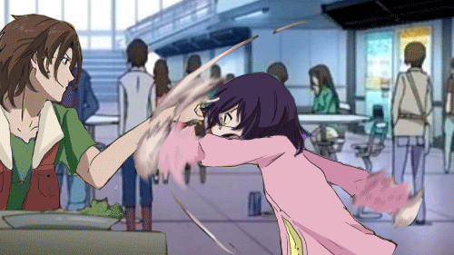

  

────────────────────────────

  I am the one who lurks in the shadows... crafting code in silence. Welcome to Nanda's GitHub. 🥷

<!-- First Row: Paragraph left, GIF right -->
<table width= "100%">
  <tr>
    <!-- Left Side: Text -->
    <td width="60%" valign="top" ">
      <h3>🌒 Ore wa Mada Owaranai 🌒</h3>
      
────────────────────────────

      
Building things end-to-end feels like unlocking a hidden technique mid-battle. Exploring the full stack realm—sometimes with a Node blade, sometimes with a TypeScript scroll—while eyeing the AI/ML frontier like it’s the next arc. Still leveling up, but already blending tech with curiosity. Side quests? Anime and TV shows, of course—because every developer needs a good storyline outside the terminal.
      

    </td>
    <!-- Right Side: GIF -->
    <td width="40%" align="center">
      
    </td>
  </tr>
</table>
<!-- Second Row: GIF left, Tech Stack right -->
<table>
  <tr>
    <!-- Left Side: GIF -->
    <td width="40%" align="center" valign="middle">
      
    </td>
    <!-- Right Side: Heading + Badges -->
    <td width="60%" align="center" valign="middle">
      
<strong>🛠️ Tech Stack I Work With:</strong>

      <!-- Badges -->
      

        <!-- Web Frontend -->
        
        
        
        
        
        
         
        <!-- Backend & DB -->
        
        
        
        
         
        <!-- Languages -->
        
        
         
        <!-- Tools -->
        
        
        
      

    </td>
  </tr>
</table>

 
<h3 align="center"> GitHub Stats & Activity</h3>

<!-- Stats and Streak Side-by-Side -->

  
  &nbsp;&nbsp;
  

<!-- Contribution Graph Below -->

  

<h3 align="center">🤝 Connect With Me</h3>

  
  

  
### 敬意を込めて、ありがとう – *With respect, thank you for your time.* 🙇‍♂️

